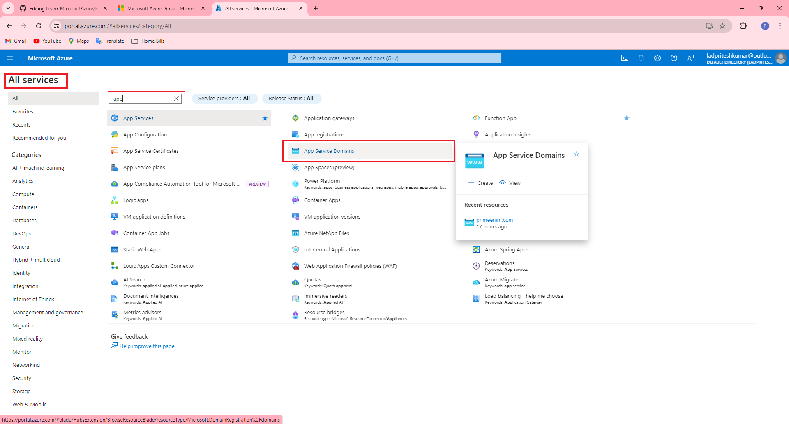
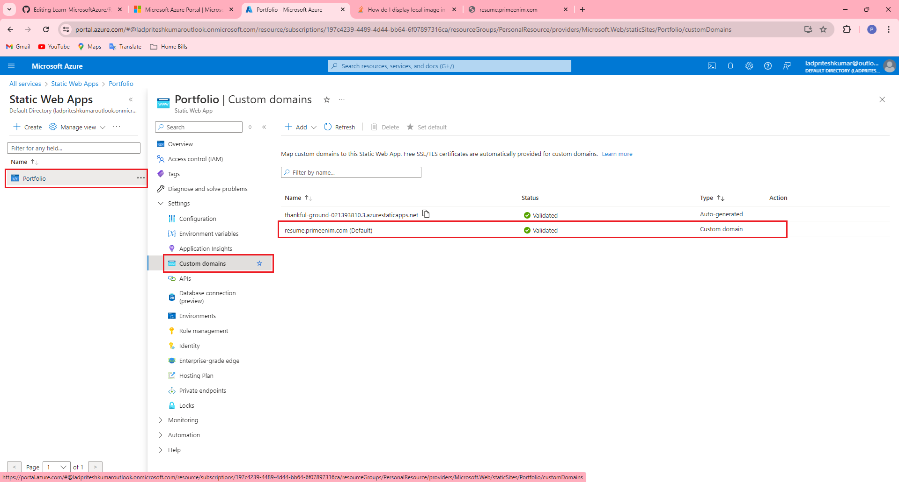

# Learn-MicrosoftAzure

We can buy Domain name from **App Service Domains**
# App Service Domains
Menu -> All Services  (search for App Service Domains)

Similary you can search for **Static Web Apps**

 **Static Web Apps** is service from Azure where you can host static web application (Sratic web apps mainly contain html and javascript)

 you can add custome domain to your static web app by going in  **Static Web apps > {your Static web App} > custom domains** .  where you can add custome domain to your static web application

